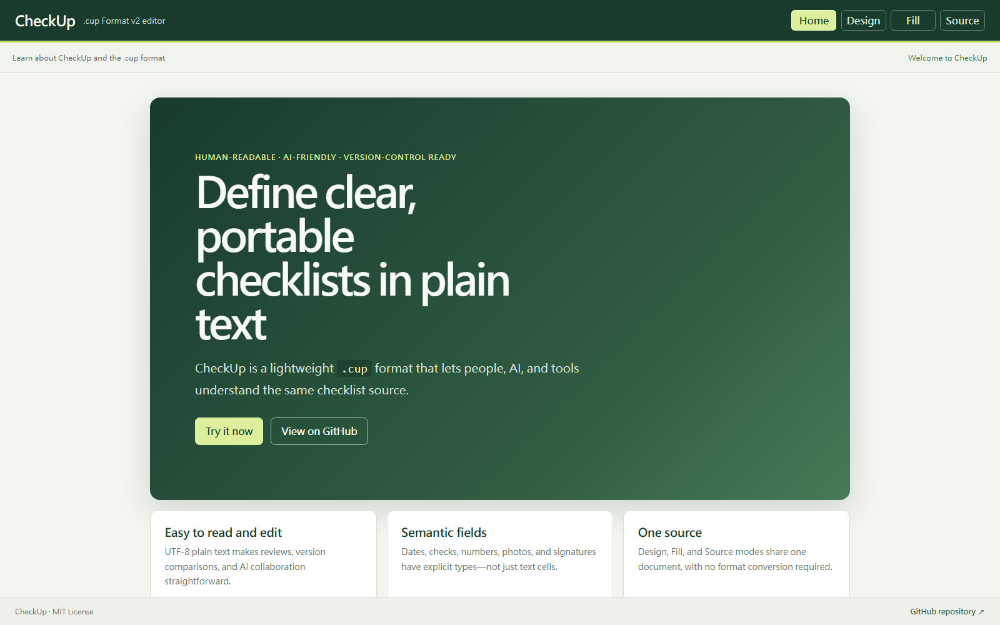

# CheckUp



**CheckUp is a human-readable, AI-friendly checklist and inspection form format designed for field inspections, recurring checklists, and structured records.**

CheckUp documents are UTF-8 plain-text files with the `.cup` extension. People and AI tools can write them, Git can review them, and applications can parse them into interactive forms. CheckUp is its own format—not a Markdown extension—and is independent of any particular editor or renderer.

## A minimal `.cup` file

```cup
@version(2)
@title(Daily Safety Check)

| $date(Date) | $check(Safety guard is secure) | $text(Notes)
```

Save this as `daily-safety-check.cup`, then open it in the Web Editor or pass its source to the parser and renderer.

**[Open the Web Editor / live demo](https://2023k-work.github.io/check-up/)** · [View a complete monthly inspection example](examples/equipment-monthly-v2.cup)

```typescript
import { parseCup } from "@checkup/parser";
import { createRenderModel } from "@checkup/renderer";

const source = `@version(2)
@title(Daily Safety Check)

| $date(Date) | $check(Safety guard is secure) | $text(Notes)`;
const result = parseCup(source);
const renderDocument = createRenderModel(result.document);
```

The parser is fault-tolerant and returns a partial document alongside diagnostics. Check `result.success` before treating a document as valid.

## Start here

- [Why CheckUp?](#why-checkup)
- [Use cases](#who-is-checkup-for)
- [Format v2 specification](https://app.notion.com/p/3b74b96f85258184848fcb7387138df1)
- [Syntax reference](#syntax-reference)
- [Examples](#real-world-examples)
- [`@checkup/parser`](src/index.ts)
- [`@checkup/renderer`](packages/renderer/src/index.ts)
- [Web Editor / demo](https://2023k-work.github.io/check-up/)

## Why CheckUp?

Checklists and inspection forms often live in spreadsheets, PDFs, word-processing documents, paper forms, or application-specific systems. Those are useful tools, but the form definition itself is not always easy to edit as plain text, compare in version control, parse programmatically, or exchange between renderers.

CheckUp makes that definition a small, portable text document:

- people can read and edit the source;
- parsers can turn it into a structured document;
- renderers can choose the right controls for each field; and
- teams can store and review changes with their existing tools.

See [Why CheckUp—and when to use it](docs/why-checkup.md) for selection criteria, limitations, and a balanced comparison with spreadsheets, CSV, JSON, YAML, Markdown, and XLSForm.

## Who is CheckUp for?

- Field teams that need portable inspection forms without locking the definition into one vendor.
- Operations and safety teams maintaining recurring checklists as reviewable text.
- Developers building custom checklist editors, renderers, or record workflows.
- AI-assisted workflows that need an explicit, compact format instead of guessing structure from prose.

## Syntax reference

CheckUp source has three visible structural ideas.

### Directives

Directives begin with `@` and describe the document or the behavior of later content:

```cup
@version(2)
@title(Daily Inspection)
@info(Complete the inspection before startup each day)
$check(Equipment is in good condition)
```

`@version(2)` must be the first meaningful construct. Comments and blank lines may appear before it.

### Fields

Fields begin with `$`. Each field declares a value schema and carries its own label. A declaration never stores the filled value itself:

```cup
@version(2)
$date(Date)
$check(Equipment exterior)
$text(Issue details)
```

### Tables

A line beginning with `|` belongs to a table. Leading `$field(...)` cells declare the columns; following rows store values in the matching cells:

```cup
@version(2)
| $date(Date) | $time(Time)
| 2026-08-16 | 09:00
| 2026-08-17 | 09:15
```

CheckUp tables are not Markdown tables. Do not add a `| --- |` separator row or trailing `|`. Declaration cells contain exactly one field, and each data row must have the same number of cells as the declared columns. Values that contain syntax characters use the standard CheckUp escapes, such as `A\|B` for a literal `|`.

## Five-minute tutorial

1. Create a UTF-8 text file named `first-check.cup`.
2. Make `@version(2)` its first meaningful construct.
3. Add a visible document name with `@title(My First Checklist)`.
4. Explain when to use it with `@info(Complete this check before starting work)`.
5. Declare typed table columns such as `$date(Date)`, `$time(Time)`, `$check(Work area is tidy)`, and `$text(Notes)`.
6. Add a data row below the declarations; actual values belong in its cells.
7. Add more data rows with the same number of cells when needed.
8. Put `@help(Make sure the walkway is free of obstacles)` immediately before the field or table it should explain.

The result is a complete document:

```cup
@version(2)
@title(My First Checklist)
@info(Complete this check before starting work)

@help(Make sure the walkway is free of obstacles)
| $date(Date) | $time(Time) | $check(Emergency exit is clear) | $text(Notes)
| 2026-08-16 | 09:00 | Yes | No issues
```

9. For a monthly template, declare a month and place `@repeat(month)` before the table to repeat:

```cup
@version(2)
@title(Monthly Checklist)

| $month(Month)
| 2026-08

@repeat(month)
| $day(Day) | $check(Completed)
| 1 | Yes
| 2 | No
```

`@repeat(month)` applies only to the next table. It uses the document's first `$month(...)` field as its month source; it does not repeat standalone fields.

10. Pass the source to `@checkup/parser`, then pass the resulting `CupDocument` to `@checkup/renderer`. See the runnable TypeScript example at the top of this README.

## Common fields

Format v2 supports these field declarations. Every field takes exactly one non-empty label.

| Field | Use | Example |
| --- | --- | --- |
| `$date` | Calendar date | `$date(Inspection Date)` |
| `$month` | Calendar month and the month source for repeat | `$month(Inspection Month)` |
| `$day` | Day of the month | `$day(Day)` |
| `$time` | Time of day | `$time(Inspection Time)` |
| `$check` | Independent checked state | `$check(Guard is Secure)` |
| `$text` | Free text | `$text(Issue Details)` |
| `$number` | Numeric input | `$number(Pressure in MPa)` |
| `$photo` | Photo resource reference | `$photo(Site Photo)` |
| `$signature` | Handwritten-signature image reference | `$signature(Inspector)` |

`$photo` and `$signature` refer to resources associated with filled record data. A signature is a handwritten-signature artifact, not cryptographic proof of identity.

## Directives

| Directive | Purpose |
| --- | --- |
| `@version(2)` | Declares Format v2; required exactly once and first among meaningful constructs. |
| `@title(text)` | Sets the visible document title; allowed at most once. |
| `@info(text)` | Adds visible document-level information. Multiple directives remain in source order. |
| `@help(text)` | Attaches help to the next renderable field or table. |
| `@help(text,path.png)` | Adds the same help with an optional image. |
| `@repeat(month)` | Marks the next table as a monthly repeat template. |

For example, this help text and image apply to the following table:

```cup
@version(2)
@help(Confirm that the pressure gauge needle is in the green zone,images/pressure.png)
| $number(Pressure in MPa) | $check(Pressure is normal)
```

Help image paths are relative to the `.cup` file, use `/`, and must stay inside the document folder tree. Absolute paths, backslashes, `.` segments, and `..` traversal are invalid.

## Real-world examples

### Factory inspection

Factory inspections can combine measurements, independent checks, evidence, and sign-off:

```cup
@version(2)
@title(Daily Air Compressor Inspection)
@info(Inspect before startup; record every failed item in the issue details.)

| $date(Date) | $time(Time) | $text(Equipment ID)
| $number(Pressure in MPa) | $check(Pressure is normal)
| $check(Exterior is in good condition) | $check(Safety guard is secure)
| $text(Issue details)
| $photo(Site photo) | $signature(Inspector)
```

See the more detailed [monthly equipment example](examples/equipment-monthly-v2.cup), which also demonstrates repeat behavior, help images, and escaping.

### Daily checklist

```cup
@version(2)
@title(Pre-Travel Checklist)
@info(Check each item before leaving home)

| $check(Identification) | $check(Tickets)
| $check(Charger) | $check(Medication)
| $text(Additional items)
```

### Approval and record

```cup
@version(2)
@title(Maintenance Completion Record)

| $date(Completion Date) | $text(Work Order ID)
| $text(Work Summary)
| $photo(Completion Photo) | $signature(Approver)
```

## Design principles

- **Human-readable:** the source remains understandable without a special editor.
- **Minimal syntax:** a small set of constructs covers document metadata, fields, and layout.
- **Plain-text first:** `.cup` files are portable UTF-8 text.
- **Renderer-independent:** the format describes intent, not a particular UI toolkit.
- **Parser-friendly:** directives, fields, and table structure are explicit.
- **Version-control friendly:** source changes are reviewable as text.
- **Portable:** form definitions are not tied to one application.
- **Explicit structure:** visible content and stored values use defined constructs.

Ordinary non-empty text is a source comment. Renderers do not display it. Content intended for users must be expressed with visible syntax such as `@title(...)`, `@info(...)`, field labels, or `@help(...)`.

## Escaping

Backslash (`\`) escapes exactly one following structural character. Format v2 defines only these escapes:

| Source | Parsed character |
| --- | --- |
| `\@` | `@` |
| `\(` | `(` |
| `\)` | `)` |
| `\,` | `,` |
| `\|` | `|` |
| `\\` | `\` |

Escapes are processed before arguments or table cells are split. For example, `$text(Area A\|B)` has one label containing a literal `|`, `$number(Pressure\, MPa)` has one label containing a comma, and a data cell written as `A\|B` stores the value `A|B`. Other sequences such as `\n`, `\t`, and `\uXXXX` are not supported escapes.

## Architecture

```text
.cup source
    ↓
@checkup/parser
    ↓
CupDocument + diagnostics
    ├─ Design mode (Schema mutations)
    ├─ Fill mode → @checkup/renderer → semantic cell edits
    └─ Source mode (complete .cup source)
```

The parser recognizes `.cup` syntax, validates v2 rules, and resolves directive targets. The Web Editor keeps one shared source/document session for Design, Fill, and Source modes; switching modes never creates another document copy. The framework-neutral renderer consumes `CupDocument` for Fill mode, while source-range mutators apply value or Schema edits without a reverse parser. Mode permissions can hide Design and Source for fill-only deployments.

## Packages

| Package | Responsibility | Input → output |
| --- | --- | --- |
| `@checkup/parser` | Fault-tolerant parsing, validation, AST construction, and directive binding | `.cup` string → `ParseResult` with `CupDocument` and diagnostics |
| `@checkup/renderer` | Framework-neutral render model creation and field-control descriptors | `CupDocument` → `RenderDocument` |
| `@checkup/web` | Three-mode browser editor with shared state, Schema design, record filling, source editing, and live diagnostics | Shared `.cup` source ↔ Design / Fill / Source views |

The parser's public API is exported from [`src/index.ts`](src/index.ts); renderer code lives in [`packages/renderer`](packages/renderer), and the Web Editor lives in [`apps/web`](apps/web).

### Local development

Node.js 20 or newer is required.

```sh
npm install
npm run typecheck
npm test
npm run build
```

Additional package checks are available as `npm run typecheck:renderer`, `npm run test:renderer`, `npm run typecheck:web`, `npm run test:web`, and `npm run build:web`. Start the local editor with:

```sh
npm run dev:web
```

## Status

CheckUp is under active development.

- **Format v2:** the repository contains a frozen normative implementation reference.
- **Parser:** implemented in strict TypeScript with validation, diagnostics, recovery, and directive binding.
- **Renderer:** a framework-neutral `RenderDocument` layer and field registry are implemented.
- **Web Editor:** Design, Fill, and Source modes share one document session. Design supports table column add/delete/reorder/type/label edits plus table help and monthly repeat; Fill writes only data-row cells; Source retains complete advanced content. Persistence and submission workflows remain future work.

## Roadmap

```text
Format v2 ✓
    ↓
Parser ✓
    ↓
Renderer core ✓
    ↓
Three-mode Web Editor ✓
    ↓
Complete interactive record workflows
```

Near-term work can build on the current layers with additional renderer implementations, record-value handling, persistence, richer editor workflows, and conformance examples. No release dates are implied by this outline.

## Contributing

Issues and pull requests are welcome. Useful contributions include parser and renderer tests, valid and invalid format examples, diagnostics improvements, UI renderers, and Web Editor improvements. Please keep behavioral changes aligned with the v2 specification and include tests where applicable.

## Specification

The current [CheckUp Format v2 rules](https://app.notion.com/p/3b74b96f85258184848fcb7387138df1) are the project reference for syntax and behavior. The concise [syntax reference](#syntax-reference) in this README covers the public constructs needed to start writing `.cup` files.

## License

CheckUp is available under the [MIT License](LICENSE).
